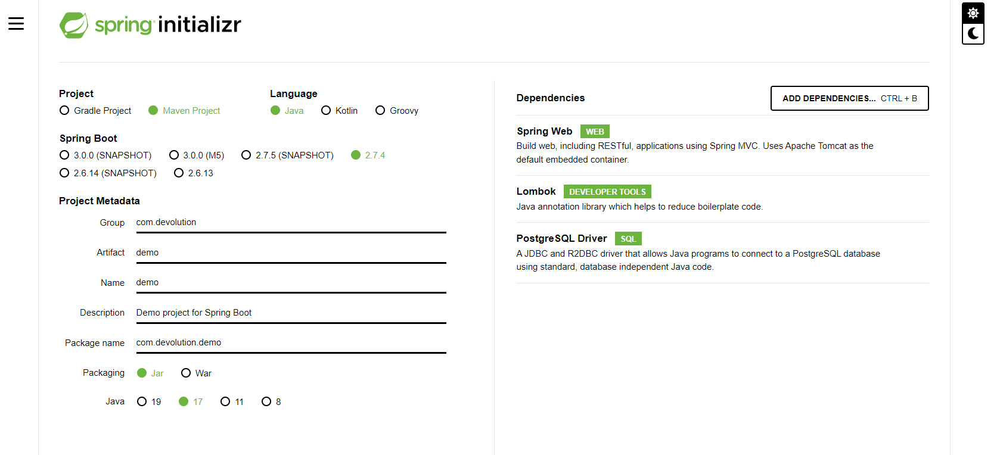
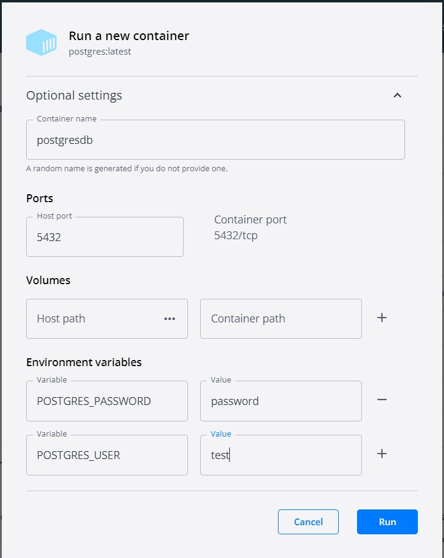

### Create project

https://start.spring.io/



### Create database in Docker

https://hub.docker.com/_/postgres/

```
docker pull postgres
```



### Create tables in database

```

drop table users cascade;
drop table purchase cascade;
drop table product cascade;
drop table purchase_product cascade;

create table users(
id bigserial primary key,
name varchar(100) not null,
age int not null
);


create table purchase(
id bigserial primary key,
name varchar(200),
iduser bigint references users(id),
date_created timestamp,
date_updated timestamp
);

create table product(
id bigserial primary key,
name varchar(200),
date_created timestamp,
date_updated timestamp,
price float,
weight float
);

create table purchase_product(
id bigserial primary key,
idpur bigint references purchase(id),
idpro bigint references product(id)
);

```


### Download Postman

https://www.postman.com/downloads/


